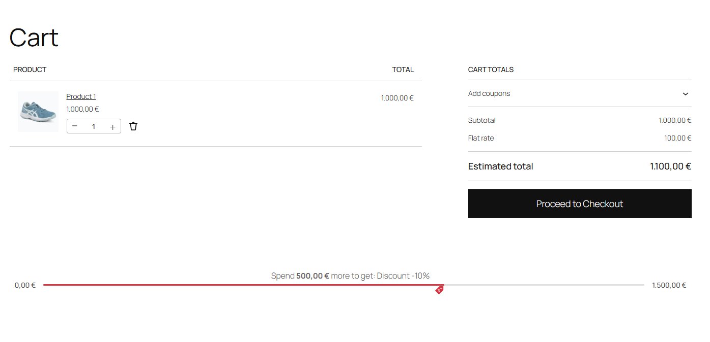
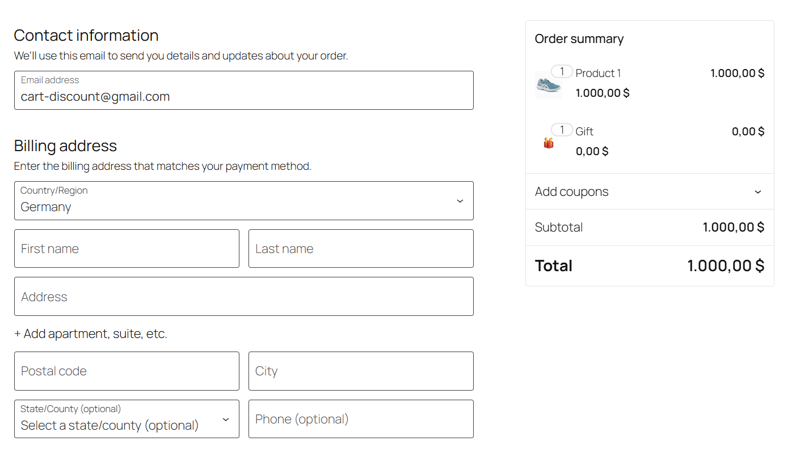
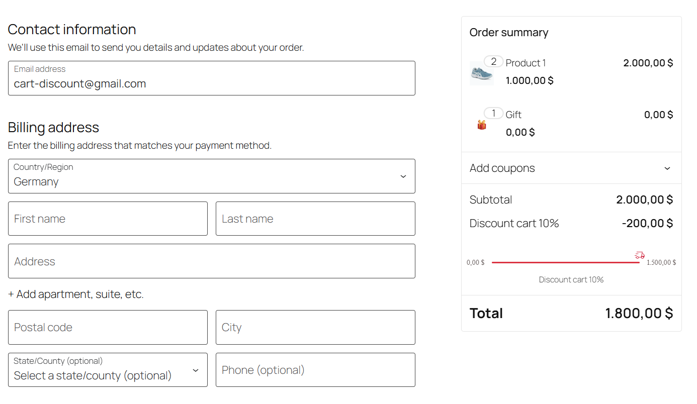

# Simple Cart Discounts for WooCommerce

> 🚀 Create flexible cart-based discount rules — from simple offers to advanced conditions, all without coding.

---

## ✨ Overview

**Simple Cart Discounts for WooCommerce** is a powerful plugin that helps you increase conversions and average order value using smart cart incentives.

Instead of relying on basic coupons, you can create dynamic discount rules based on cart conditions, products, and user behavior.

---

## 🔥 Key Features

* 🧠 Smart cart-based discount rules
* 🎁 Automatic free gifts
* 🚚 Free shipping conditions
* 📊 Cart progress bar (increase AOV)
* ⚙️ Flexible rule combinations
* 👥 User-based conditions
* 🧩 Works seamlessly with WooCommerce
* ❌ No coding required

---

## 💡 Use Cases

* Offer **free shipping over a certain amount**
* Add a **free gift when cart reaches a goal**
* Create **“Buy more, save more” promotions**
* Apply **conditional discounts automatically**
* Replace default WooCommerce coupons with smarter logic

---

## 📦 Installation

1. Upload the plugin to `/wp-content/plugins/`
2. Activate it via the WordPress admin panel
3. Navigate to plugin settings
4. Start creating discount rules

---

## 📊 Display Progress Bar

You can display the progress bar in multiple ways:

### 🧱 Gutenberg Block
Add the **Discounts Cart → Progress Bar** block in the editor.

### 🔧 Shortcode
[dcw_progress_discount]

### ⚙️ PHP (Theme developers)

```php
do_action('dcw_render_progress_card');
```

OR

```php
echo do_shortcode('[dcw_progress_discount]');
```

---

## ⚙️ How It Works

1. Create a new rule
2. Set conditions (cart total, products, users, etc.)
3. Define the reward (discount, free shipping, gift)
4. Save and test

---

## 🛠 Requirements

* WordPress 5.8+
* WooCommerce 6.0+
* PHP 7.4+

---

## 📸 Screenshots

| Progress Bar | Free Gift | Rules Applied |
|-------------|----------|----------|
| |  |  |

---

## 🚀 Roadmap

* Advanced rule conditions
* UI improvements
* Analytics for discount performance
* PRO features

---

## 🤝 Contributing

Contributions are welcome!

1. Fork the repository
2. Create a feature branch
3. Submit a pull request

---

## 🐛 Issues

Found a bug or have a feature request?
Open an issue on GitHub.

---

## 📄 License

Licensed under GPLv2 or later.

---

## ⭐ Support

If you like this plugin, give it a star ⭐ on GitHub — it helps a lot!
